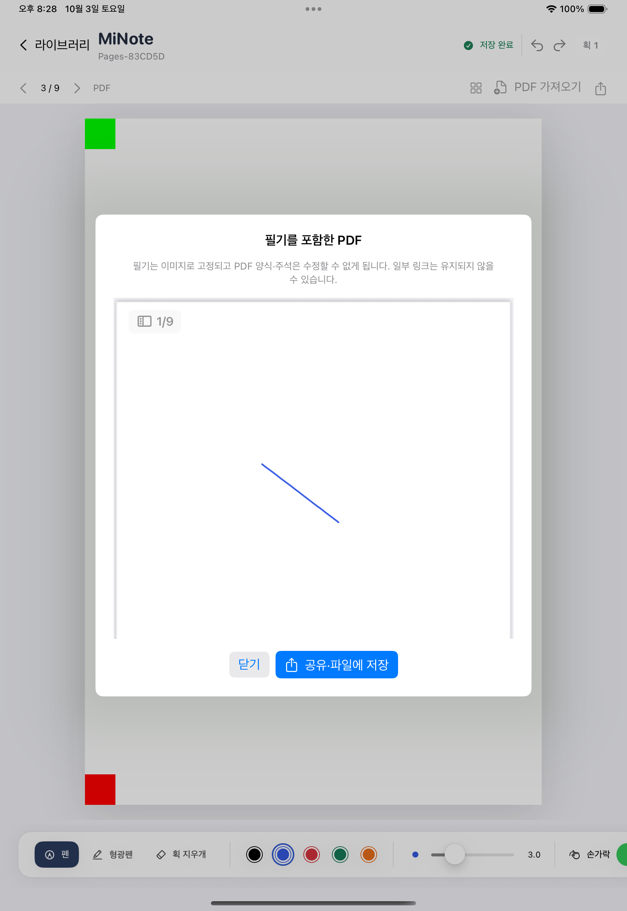

## 2026-10-03 M1-B 구현 결과 — 페이지 관리와 여러 PDF

**상태: 페이지/다중 PDF 구현·양 OS 시뮬레이터 검증·한 번의 별도 리뷰 완료. iPad 제품 전체는 아직 개발 중이다.**

### 사용자가 할 수 있는 것

- 한 노트에 PDF 여러 개를 넣는다. 선택한 페이지 바로 뒤에 새 PDF의 페이지가 들어가며, 같은 파일명의 PDF도 UUID별 원본으로 보존한다. A/B PDF 사이를 오가거나 다른 노트를 열었다 돌아와도 각 페이지 필기가 유지된다.
- 페이지 관리에서 빈/줄/격자 A4를 추가하고 썸네일을 보며 페이지를 선택·복제·앞뒤 이동·재정렬한다. 빈 페이지의 용지를 바꾸고 책갈피 목록으로 찾는다. PDF 배경의 용지는 변경하지 않는다.
- 페이지를 삭제하면 필기·원본 참조·용지·책갈피를 노트 내부에 보관한다. 삭제 목록에서 원래 ID와 필기로 복원한다. 마지막 활성 페이지는 삭제할 수 없다. 영구 제거와 파일 정리는 후속이다.
- PDF 페이지 복제본은 같은 원본을 보면서 독립적인 획과 페이지 ID로 편집한다. PDF 내보내기는 현재 활성 순서만 출력하며, 복제본끼리 필기나 주석이 섞이지 않는다. 빈/줄/격자 페이지도 같은 출력에 포함한다.
- 앱을 다시 실행하면 마지막 선택 페이지와 다중 PDF, 보관 페이지, 필기, 용지, 책갈피를 복원한다. 저장·가져오기 실패에서는 기존 화면과 필기를 유지하고 오류를 표시한다.

### 문서와 기술 판단

- Foundation 공통 모델/저장은 schema v3의 `pdfAssets` 배열, 페이지별 `assetID`, `paper`, `isBookmarked`, `deletedPages`로 확장했다. catalog는 version 1을 유지한다. UI/PencilKit/PDFKit은 앱에 두며 외부 의존성을 추가하지 않았다.
- v1/v2를 읽을 때 당시의 단일 페이지/단일 PDF 전체 index 규칙을 먼저 검사한다. 기존 UUID·revision·획·원본 geometry는 보존하고 새 용지/책갈피/자산 연결만 정규화한다. 정상 raw 원본과 backup bytes를 유지한다. v3 필수 metadata 누락은 손상 오류이며 기본값으로 숨기지 않는다.
- 구조 명령은 value를 변경하지 않고 새 문서를 만들며 성공당 revision을 한 번 증가시킨다. DocumentStore actor는 기대 revision 읽기부터 원자 저장까지 중간 suspension 없이 처리한다. 페이지 순서와 마지막 선택을 같은 문서에 commit한다.
- PDF는 자산을 먼저 원자 기록하고 JSON 참조를 다음에 commit한다. 전체 등록 자산을 검사하며, 두 번째 자산이 누락됐다고 첫 PDF나 빈 노트로 대체하지 않는다. 실패한 import 자산은 안전하게 남기고 M1-C에서 수명주기를 관리한다.
- 내보내기는 각 원본 PDFPage를 복사한 뒤 해당 페이지 필기만 합성한다. 원본 bytes를 수정하지 않는다. 화면·썸네일·PDF 출력은 24pt 간격/0.5pt 선의 같은 PaperRenderer를 공유한다.
- 현재 PDFDocument cache는 2개, thumbnail cache는 24개/최대 256px다. 보이는 목록의 thumbnail만 만들고 pageID/revision이 바뀐 늦은 결과는 게시하지 않는다. 실제 대형 문서 성능은 M3에서 측정한다.

### 비동기 작업 중 필기 보존

현재 native drawing을 먼저 저장한 뒤 구조/선택을 바꾼다. 첫 await 전에 잠그고 await 뒤 전체 snapshot과 저장 상태를 재확인하며, 페이지별 canvas generation으로 이전 delegate가 다른 페이지 필기를 덮지 않게 한다.

처리 잠금 직전에 큐에 있던 필기는 버리지 않는다. 실제 actor commit 대기 중 callback이 들어온 경우 원래 구조와 최신 필기를 더 높은 revision으로 보상 저장하고 구조 작업을 취소한다. 미지원 drawing 또는 보상 저장 실패도 화면의 필기를 유지한다. 드문 경합에서 추가 write가 필요하며, 보상 revision 하나를 위해 세션 구조 작업은 Int64.max−1 이상을 거부한다. 통합 구조 Undo는 제공하지 않으며 페이지 전환/구조 변경 때 Canvas Undo는 다시 시작한다.

### 독립 문서 왕복

실제 PencilKit에서 만든 `multi-source.json`을 독립 JavaScript 명령으로 수정해 `multi-edited.json`을 생성했다. 활성 페이지 획 이동·삭제·추가 뒤에도 두 PDF 자산, 삭제 보관 페이지, 원래 ID/용지/책갈피가 유지된다. iPad는 결과를 PencilKit으로 다시 구성하고 추가·삭제·Undo/Redo·저장·재열기를 확인한다.

기존 v2 fixture는 입력과 출력을 그대로 v2로 유지한다. 새 v3 input은 v3를 유지한다. 브라우저 시험 도구는 용지와 기본 획을 근사 렌더링하지만 PDF 원본 배경이나 완전한 다른 플랫폼 앱을 구현한 것은 아니다.

### 검증 근거

- `swift test --package-path Packages/MiNoteCore`: **60개, 실패 0**, exit 0. v1/v2 보존 이주, 미래/필수 정보 누락 오류, 페이지 명령/복구·stale revision·I/O 실패, 다중 자산 저장을 포함한다.
- `node --test Tools/PortableInk/*.test.mjs`: **31개, 실패 0**. v2 및 `--v3` roundtrip `--check` 각각 exit 0. DOM 실제 입력 흐름과 v3 metadata 보존·잘못된 관계·용지 geometry를 포함한다.
- iPadOS 18.6/26.4: 각각 **앱 단위 53개, 실패 0**. 실제 actor의 late callback, PDF 복제본의 독립 필기 pixel/반복 출력·crop/회전/원본 bytes, cache 상한/stale thumbnail과 native v3 왕복을 확인했다.
- 최종 순차 전체 실행은 양 OS 각각 **일반 UI 5개 통과, 실패 0**, xcodebuild exit 0 / TEST SUCCEEDED. 일반 suite의 이주 전용 1개는 fixture 부재로 skip하며 별도 이주 실행과 구분한다.
- 별도 빈 전용 시뮬레이터의 legacy 이주 UI는 양 OS 각각 **1개 통과, skip 0**, xcodebuild exit 0. helper는 raw JSON/backup/PDF bytes 불변과 새 v3의 IDs/ink/PDF, revision 증가를 재확인했다. 일반 suite의 fixture-only skip과 분리한다.
- UI는 실제 finger gesture, Files에서 PDF A/B 선택, 페이지 추가/복제/이동/책갈피/삭제/복원, 재실행, PDF 미리보기를 실행한다. programmatic native callback 검증은 실제 Pencil 지연 측정과 구분한다.
- 실패 이력: 첫 양 OS 전체에서 누적 폴더의 off-screen selector와 SwiftUI alert의 부모·자식 중복 Button이 실패했다. alert 범위를 좁히고 목록을 스크롤하도록 했다. 이어 테스트의 top swipeDown이 이동 시트를 닫는 것을 AX/log로 확인하고 수정했다. 26.4의 한 retry는 이전 동작을 실행해 새 DerivedData/캐시 비활성화로 분리 검증했다. 집중 PageUI는 diagnostic 출력 추가만으로 통과했고, 최종 두 OS 전체는 순차 실행/verbose sysdiagnose 비활성화로 모두 통과했다. 직전 transient 실패의 원인은 특정하지 않았으며 재현 없이 앱 동작을 바꾸지 않았다. 이 실패들을 성공으로 기록하지 않는다.
- 로그/result: `/private/tmp/minote-m1b-core-before-review.log`, `minote-m1b-node-before-review.log`, `minote-m1b18-serial-final.log/xcresult`, `minote-m1b26-serial-final.log/xcresult`, `minote-m1b18-migration.log/xcresult`, `minote-m1b26-migration.log/xcresult`. 첫 실패 이력도 보존했다.

### 별도 리뷰

전체 `80d14c2..1d67d9a`를 fresh reviewer 한 번이 읽기 전용으로 점검했다. 확정 Critical/Important/Minor 코드 결함은 없었다. 판정은 최종 UI 실패/미종결 때문에 With fixes였으며, 이를 시뮬레이터 성공으로 표시하지 않았다. 추측성 앱 수정이나 추가 reviewer를 만들지 않고 이후 최종 전체18.6/26.4 GREEN으로 검증 게이트를 충족했다.

검토에서 확인한 경계는 복제된 페이지/획 ID와 독립 PDF 출력, 삭제/복원 선택, 두 번째 PDF 실패 보존, actor commit 중 최신 필기 보상 저장, legacy/JS 호환이다. 강제 종료 직전의 미저장 필기·실제 전체 메모리·인위적인 지원 밖 legacy 충돌·외부 프로세스/자산 변조는 완전 보장을 주장하지 않는다. 통합 Undo/백업/정리는 후속이며, 물리 Pencil/VoiceOver 전체 인증/외부 PDF 뷰어는 미검증이다. 판단과 비용은 PROGRESS 및 보존된 ledger에 있다.

### 커밋과 재개 자료

- `28ea031`: schema v3와 legacy/여러 자산 보존 이주.
- `c21d9ef`: 페이지 명령·삭제 보관/복원과 리비전 저장.
- `c977bd4`: 여러 PDF 연결·독립 복제 페이지 출력.
- `0f87b10`: 비동기 구조 작업 중 최신 필기 보존·cache.
- `ad46dc4`: 페이지 manager·용지·책갈피·복원 실제 UI.
- `1d67d9a`: 독립 v2/v3 왕복·strict metadata·이주 검증과 시험 selector.
- `fddbd66`: 실패 시 실제 Files 화면을 남기는 UI diagnostic과 최종 검증 체크포인트.
- 작업 위치는 기본 저장소 main. branch/worktree/PR/push 없음. 최종 문서 커밋과 Notion 시각은 PROGRESS에서 확인한다.
- 재개 자료는 AGENTS/PROGRESS, `docs/format/document-v3.md`, M1-B 체크리스트, 다음 M1-C 계획이다. 완료된 이전 단계를 반복하지 않는다.

### 실제 화면 근거

통과한 PageManager UI 시험의 실제 18.6 화면이다. 두 PDF/용지/복제/복원 뒤 9개 활성 페이지를 출력한 미리보기이며, 실제 Pencil 성능이나 외부 PDF 뷰어의 검증 자료는 아니다.

### 현재 제한과 다음 계획

- `.minote` 편집 백업·새 노트 복원, 영구 제거, export/import orphan cleanup은 다음 **M1-C**다. streaming stored-only ZIP, backup 참조와 purge journal, 공유/미리보기 lease 보호를 실제 결과 기반으로 계획했다. **계획만 작성했고 M1-C 코드는 구현하지 않았다.**
- PDF당 100MiB/500페이지/한 변 2000pt, 한 노트 활성+삭제 페이지 1000개와 보관 자산 합계 500MiB는 초기 안전 상한이며 실기기 성능 보장 수치가 아니다.
- PDF 출력의 필기는 최대 216dpi/4096px 이미지다. 원본 텍스트·벡터/crop/회전은 검증했지만 양식·원본 주석·일부 링크는 출력 영향을 받는다. PDF는 편집 원본 백업이 아니다.
- 사용자 표지·템플릿/임의 크기, 통합 Undo, 즐겨찾기/검색, 올가미/텍스트/이미지, 다중 창·동기화·협업·다른 플랫폼은 후속이다.
- 물리 Apple Pencil 지연·손바닥 입력·발열·장시간 필기·대형 실제 PDF·전체 접근성/분할 화면은 확인 대기다. 이번 단계는 시뮬레이터에서 검증한 로컬 기능이다.
