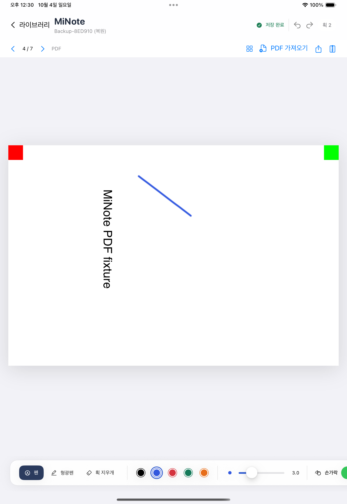

# M1-C — 편집 원본 백업과 안전한 파일 정리

작성일: 2026-10-04. **M1-C 구현·검증·한 번 리뷰·Notion 기록 완료**. iPad 제품 전체 개발 완료를 의미하지 않는다.

## 사용자가 할 수 있는 것

- 편집기의 **편집 원본 백업**으로 `.minote`를 생성하고 공유 메뉴의 **파일에 저장**으로 보관한다. 마지막 필기 저장과 snapshot 확인 뒤 내보내며 진행률과 취소를 제공한다.
- 라이브러리의 **백업에서 새 노트 복원** 또는 Files에서 MiNote로 열기로 복원한다. 기존 노트를 덮지 않고 제목에 `(복원)`을 붙여 추가한다. 같은 문서 UUID가 있으면 문서 ID만 새로 만들고 페이지·획·자산 ID를 보존한다.
- 필기 제어점·도구·색·압력·변환, 페이지 순서·용지·책갈피·마지막 위치, 삭제 보관 페이지와 모든 등록 PDF 원본을 다시 편집한다. Undo 기록·썸네일·폴더 전체는 백업하지 않는다.
- **저장 공간 정리**에서 미사용 PDF와 보호·보류 이유를 확인하고 확인 후 정리한다. 정상 primary/backup 어디에서든 쓰는 자산은 삭제하지 않는다.
- 삭제 보관 페이지와 휴지통 노트는 **영구 삭제** 확인 뒤 제거한다. 취소는 데이터를 유지한다. 편집 중인 노트를 직접 영구 제거하지 못한다.

## 기술 판단과 보존 경계

### 작은 표준 ZIP 부분집합

외부 의존성 없이 ZIP32의 stored entry만 구현했다. `manifest.json`, `document.json`, `assets/<UUID>.pdf`만 허용하고 경로·중복·링크·header/offset/EOF·길이·CRC를 검사한다. deflate/암호/ZIP64/descriptor/extra/comment 등은 오류로 거부한다. 일반 ZIP reader를 대체하지 않는다. CRC는 우발적 손상 검출이며 인증 서명이 아니다.

schema v3/catalog v1을 유지하고 archive v1 manifest에 문서 ID·revision·schema·각 entry 길이/CRC를 둔다. PDF bulk I/O는64KiB씩 진행하며 취소를 확인한다. archive640MiB/본문128MiB/manifest1MiB/1002항목 제한을 둔다. JSON은 상한 안에서 메모리에 decode한다. 이 수치는 실기기 최대 문서 성능 보장으로 사용하지 않는다.

같은 부모의 새 UUID stage에 출력 완료·sync 후 원자 교체한다. 취소·I/O 실패는 이전 목적 파일을 유지한다. 복원은 own staging을 다시 CRC/값 검사하고, 앱 PDFKit으로 모든 등록 PDF와 활성·삭제 페이지 geometry를 확인한 뒤 새 note directory를 완성해 catalog에 연결한다. 실패한 catalog 뒤 완성 orphan은 다음 load에서 회수한다. 기존 노트/PDF bytes는 변경하지 않는다.

### 정상 복구본도 현재 데이터의 일부

정리는 DocumentStore actor에서 자산 attach/save와 직렬화한다. primary와 존재하는 backup을 모두 검증해 전체 등록 자산의 union을 보호한다. 하나라도 future/손상/읽기 실패이면 그 노트의 정리를 보류한다. 알려진 canonical UUID PDF만 후보이며 legacy·알 수 없는 파일은 보존한다. 페이지 영구 제거는 정확한 deleted IDs/expected revision만 허용하고 이전 정상 문서를 backup으로 남긴다. backup rotation 후에야 참조가 없는 PDF를 후보로 본다.

노트 영구 제거는 prepared→catalogCommitted→finished journal과 quarantine을 사용한다. primary catalog commit이 결정 경계다. commit 전에는 되돌리고, 이후에는 fallback catalog에서도 대상 참조를 제거한 뒤 bytes를 지운다. journal recovery는 orphan 발견보다 먼저 실행한다. 오류 journal은 편집을 차단하며 추측 제거하지 않는다. 예전 DocumentStore handle은 retire해 삭제 디렉터리 재생성을 막는다.

### 실제 소비자까지 유지하는 출력 파일

PDF/백업은 같은 ExportFileRegistry를 사용한다. 미리보기 producer lease와 UIKit share lease를 따로 유지한다. 마지막 소비자가 종료하고7일 지난 등록 파일만 정리한다. registry 오류·unknown directory·알 수 없는 내용은 보존한다. 프로세스 중단 때 남은 lease도 보호한다.

외부 URL와 앱 내부 importer는 하나의 session 복원 task를 사용한다. 초기 load/다른 작업 중 URL은 security scope를 유지하며 대기하고 순서대로 처리한다. 취소는 대기 요청과 현재 작업에 적용한다. 최신 native 필기를 flush하고 async 작업 뒤 문서 전체·저장 상태를 재확인하며, 늦은 필기가 있으면 오래된 백업을 성공으로 제공하지 않는다.

## 실제 검증과 실패 이력

- Core 최종 **78/0**: 전체 문서/PDF byte 왕복, unsafe ZIP matrix·CRC/future·취소/ENOSPC 기존 파일 보존, 빈/중복 복원·catalog 실패 orphan, 정상 backup-only 참조 보호·삭제 페이지 purge,7개 purge 쓰기 경계와 fallback 재등장 방지, retired handle, 정리 결과/중단 staging 보류.
- Node **31/0**, v2/v3 fixture `--check` exit0. 독립 문서 교환 도구의 기존 시험을 유지했다.
- 관련 앱 **18/0**: 백업 최신 필기·late callback·실패 보존·PDFKit 거부·활성 editor 보호, registry lease·restart·unknown 보호, 기존 라이브러리 경합과 외부 요청/취소 회귀. 최종 앱 전체는 양 OS 각각 **64/0**이다.
- 실제18.6 Files UI: finger ink+PDF A/B+7활성/1삭제+용지/책갈피 → `.minote` 파일 저장 → 동일 라이브러리 중복 복원 → 추가 필기/Undo/Redo/저장/relaunch. 독립 빈 설치18 복원은1/0/skip0이며 helper로 IDs/metadata/모든 PDF bytes를 재검증했다.
- 실제 이동 파일 `Backup-8ED910.minote` SHA256: `cc42644bded993a5ca69d7899a9da7d1d78755329d3dd1f2885007db680ed361`. raw JSON을 다시 포장한 대체 입력을 쓰지 않았다.
- 신규 전용18.6/26.4 각각 legacy 이주 UI1/0/skip0과 원본 JSON/backup/PDF bytes 검증 성공. 실제 Files 파일의 빈 설치 백업 이동도 각 UI1/0/skip0와 helper 검증 exit0이다. 신규 기기 데이터를 삭제/reseed하지 않았으며 시험 뒤 shutdown/보존했다.
- 최종26 전체는 app64/0+일반UI7통과/fixture-only2skip/0실패, exit0. 최종18 전체는 app64/0+일반UI6통과/fixture-only2skip/백업UI1실패, exit65다. 제품 수정 없이 failed UI만 enabled/hittable action 대기로 집중 재시험해1/0/skip0·exit0을 확인했다. 두 명령을 합친 명령이 성공했다고 기록하지 않는다. 실제 Files 저장/원본 유지·중복 복원/재편집/Undo·Redo/저장/relaunch를 모두 재확인했다.
- 첫 UI 실패에서는 alert 표시 직후 탭, 중첩 fileImporter, 전역 MiNote cell이 숨은 shareCell을 고른 문제를 각각 로그/AX로 구분했다. importer는 library 화면으로 한정하고 Files 폴더는 실제 File View 안에서 선택했다. 빈 설치 첫 실패는 Transfer-origin.json을 잘못 탭해 정확한 .minote 파일명으로 고쳤다. 기존 데이터/시험 로그를 지우거나 reseed하지 않았다.
- 첫 전체18 app fixture lookup7실패는 실제 빌드/설치 리소스가 존재했다. 메시지 진단과 다음 전체 app62/0에서 재현되지 않아 원인은 단정하지 않았다. 최초 전체 exit65와 그 안의 UI7통과/2fixture skip을 분리 기록했다. 리뷰 수정 후 양 OS 전체 검증과18 failed UI의 집중 재검증은 위 결과를 따른다. SaveToFiles action 탭 미처리는 좌표가 실제 row에 맞았으나 원인이 미확정이며 플랫폼 동작을 추측 수정하지 않았다.
- Swift6 test gate 컴파일 제한과 삭제 후 /var 별칭 비교 실패는 테스트 문제로 수정했고 제품 저장 경계를 추측 변경하지 않았다.

## 한 번의 별도 리뷰

fresh reviewer가19e10af..68ba26f를 읽기 전용으로 점검했다. Critical0, Important2, Minor2. 추가 reviewer 없이 중요한 문제를 실제 RED→GREEN으로 수정했다.

1. 외부 open의 load guard 때문에 요청이 사라지는 interleaving을 실제 load gate에서 재현했다. busy 동안 요청을 보관하고 초기/기존 작업 종료 뒤 처리한다.
2. 외부 restore는 task handle이 없어 취소할 수 없었다. 두 entry point에 shared task/cancel UI를 연결하고 실제 복사 gate에서 cancel 전후 기존 노트 byte 보존을 검증했다.
3. cleanup은 이미 지운 파일을 후보 수/용량에 포함했다. 성공 제거 항목을 남은 후보에서 제외했다.
4. 프로세스 중단 전 완성되지 않은 `.restore-UUID`는 남을 수 있다. 소유권을 prefix로 추측해 지우지 않고 보류 이유로 보고한다. 자동 회수에는 durable ownership 기록이 필요하며 후속으로 남긴다.

실기기/최대 크기 memory/외부 share 소비자/multi-process/sync/generic ZIP/폴더 백업/Undo 백업/후속 객체 편집은 이번 구현의 완료 주장에 포함하지 않는다. 검사에서 제외한 각 판단은 PROGRESS와 ledger에 보존했다.

## 커밋·재개 자료

- `4649208`: streaming archive/CRC/경로·버전/원자 출력.
- `ab1bd27`: 기존 노트 보존·새 노트 복원.
- `c94a93a`: 정상 backup 보호 정리·삭제 페이지 purge·노트 journal recovery.
- `68ba26f`: Files/PDFKit/백업·공유 lease·확인 UI.
- `a64b490`: 외부 요청/취소 회귀 수정·정리 결과/보류·독립 이동 helper.
- `30e9f8c`: Files 공유 action의 enabled/hittable 상태 대기와 실패/성공 분리 기록.

main에서 직접 작업하고 push하지 않았다. 최종 문서 커밋은 이 결과 기록을 포함하는 Git HEAD와 PROGRESS를 대조한다. Notion 반영은 **2026-10-04T04:22:23.119Z (13:22:23 KST)**이며 재조회에서 기존 내용 전체 prefix 보존·M1-C 제목1회·시험표·M2 계획만·승인받은 실제 screenshot 첨부를 확인했다. 첫 screenshot POST는 auto-review가 명시 승인 부재로 거절했으며 실행되지 않았다. 사용자에게 해당 화면 전송을 명시 승인받은 뒤 같은 POST를 완료했다. `AGENTS.md` → `docs/PROGRESS.md` → 현재 계획 → 관련 코드 순으로 재개한다.

### 최종 실행 근거

| 범위 | 실제 결과 | 로그/result 이름(`/private/tmp/`) |
|---|---|---|
| Core | 78통과/0실패 | minote-m1c-core-review-green2.log |
| Node/v2·v3 | 31통과/0실패, 두 check exit0 | minote-m1c-node-final.log |
| 18.6 전체 | app64/0, UI6통과·1실패·2skip, exit65 | minote-m1c18-review-final.log/xcresult |
| 18.6 실패 UI 집중 | 실제 Files 백업 UI1/0/skip0, exit0 | minote-m1c-backup-ui18-action-hittable.log/xcresult |
| 26.4 전체 | app64/0, UI7통과·2skip·0실패, exit0 | minote-m1c26-review-final.log/xcresult |
| 18.6 독립 이주/이동 | 각 UI1/0/skip0와 bytes verify exit0 | minote-m1c18-migration, minote-m1c18-backup-exact-file, minote-m1c18-isolated, minote-m1c18-backup-verify |
| 26.4 독립 이주/이동 | 각 UI1/0/skip0와 bytes verify exit0 | minote-m1c26-migration, minote-m1c26-backup, minote-m1c26-isolated |

전체18 실패와 그중 성공한 app/다른UI 및 집중 재시험을 구분한다. 이전 실패의 정확한 이력·명령은 PROGRESS를 따른다. 마감 evidence-check는 보존된 각 test case와 Notion receipt/문서를 검사하며 새로운 Xcode 실행으로 기록하지 않는다.

실제18.6 동일 라이브러리 복원 UI 시험의 screenshot이다.4/7 PDF 페이지·복원 제목·2획·저장 완료를 확인했다. Pencil 실기기 측정 화면은 아니다.

## 제한과 다음 단계

- 노트별 수동 백업이며 폴더 전체/자동 클라우드 백업·서버 동기화는 없다. Undo 이력은 복원/페이지 전환 뒤 새로 시작한다.
- 프로세스 중단 시 사용 중이던 export lease는 무기한 보호될 수 있다. 강제 중단된 복원 stage도 자동 제거하지 않고 보류한다. 보류 stage byte count는 이번 보고의 용량 합계에 포함하지 않는다. future durable ownership 관리로 안전하게 회수할 필요가 있다.
- 실제 Pencil 지연·손바닥·발열·장시간 필기·큰 이미지 PDF/JSON·전체 접근성·외부 provider/앱별 공유 호환은 미검증이다.
- 다음은 **M2-A 올가미 획 선택·평행 이동**, 현재 페이지 native Undo와 ID·저장·백업·문서 좌표를 먼저 검증한다. `docs/superpowers/plans/2026-10-04-m2-a-lasso-move.md`는 계획만 작성했으며 구현하지 않았다. 이후 선택 삭제/복제, 텍스트, 이미지, 검색, 혼합 객체 왕복을 각각 작게 진행한다.
