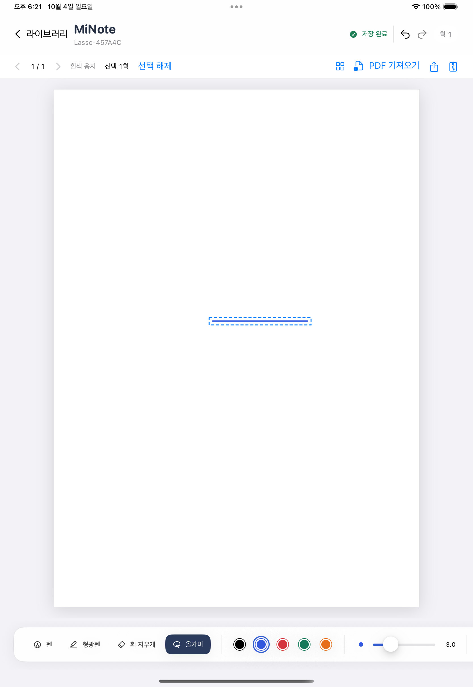
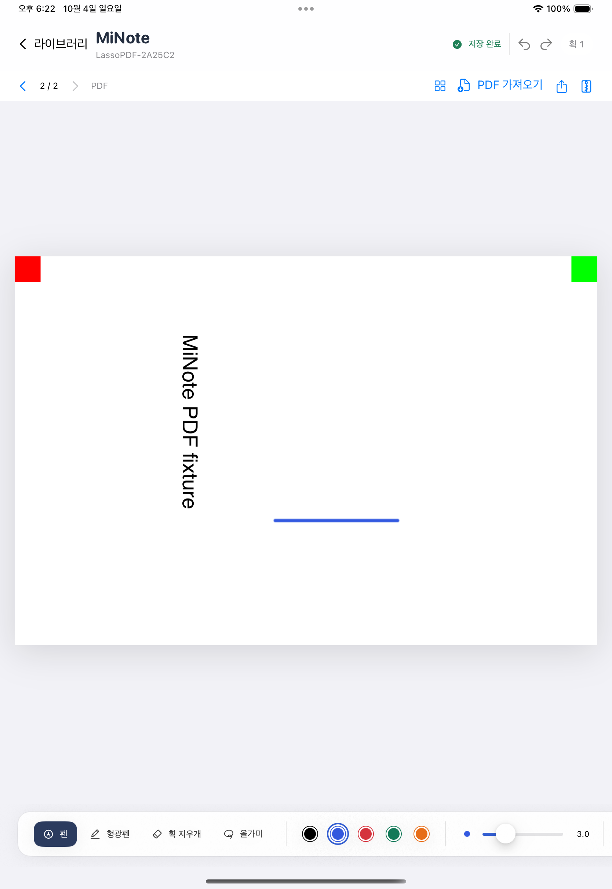

# M2-A 올가미 획 선택·평행 이동

**상태: 완료 — 2026-10-04.** 한 번 리뷰의 두 Important를 수정했고18.6/26.4 전체와 실제 저장 observer가 통과했다. 결과·재개 계획을 저장소와 Notion에 기록했다. 최종 인계 문서 commit/작업 트리 상태는 PROGRESS와 Git HEAD를 대조한다.

## 이번에 구현한 동작

빈 용지와 PDF 위에서 **올가미**로 획 전체를 선택한다. 선택 획 수와 선택 해제 버튼을 제공하며 선택 내부를 끌면 페이지 좌표로 평행 이동한다. drag 동안은 원래 필기와 임시 ghost를 표시하고 종료 한 번만 저장 대상에 반영한다. 취소·0 이동·선택 해제·확대·화면 회전은 필기를 바꾸지 않는다.

선택은 닫힌 even-odd 영역/경계와 보간 중심선의 교차로 판정한다. 굵기 외곽만 닿는 획은 이번 규칙에서 선택하지 않는다. affine 변환을 한 번 적용하며 페이지 공간 최대2pt 간격으로 검사한다. 유한 페이지 밖 이동을 허용한다. Pencil 기본 입력과 시뮬레이터 손가락 전환, navigation pan/zoom을 유지한다.

현재 페이지 pen→선택 이동→pen을 같은 이력으로 Undo/Redo한다. 이동한 획을 native 획 지우개로 지운 뒤에도 Undo/Redo가 이어진다. 자동 저장·재실행·편집 원본 백업/새 노트 복원·독립 JSON 편집에서 위치/안정 UUID를 유지하고 원본 PDF bytes를 바꾸지 않는다. 선택 overlay는 백업/PDF 출력에 포함하지 않는다.

## 설계 결정과 시행착오

Foundation `InkCommands.translate`는 정확한 활성 page/선택 UUID/revision·문서 무결성을 검사하고 transform.tx/ty만 더한다. 성공한 이동/Undo/Redo의 revision은 +1이며 빈 선택/0 이동은 무변경이다. schema v3/catalog v1/backup v1은 유지했다.

최초 접근은 native PencilKit undo 이력에 이동을 끼우는 방식이었다. 실제 입력의 Undo3는 진행됐지만 drawing replacement 뒤 마지막 native Redo pen2가 실패했다. 원래 native PKStroke/drawing 보존만으로도 해결되지 않았다. production `InkCanvasView`가 실제 UndoManager를 소유하고 opaque 내부 등록을 비활성화하며, 실제 delegate 입력과 명령 snapshot을 같은 이력에 명시적으로 등록하도록 바꿨다. 실제 UI와 저장 JSON으로 그 순서를 검증했다. 프로그램 입력만 사용하는 가짜 manager의 성공으로 대체하지 않았다.

한 gesture의 후속 callback은 해당 entry의 최종 drawing으로 합친다. inverse replay 전에 manager registration을 활성화해 Foundation inverse group을 연다. 이전 구현은 첫 Undo에서 inverse group 미시작 crash가 있었으며 crash stack을 확인하고 수정했다. 명시적 final canvas 캡처도 같은 coordinator를 통과한다. page/generation이 바뀌면 새 이력을 시작한다.

현재 canonical stroke value와 같은 UUID의 이동 전후 historical alias를 구분해 stable ID를 보존한다. 다른 UUID 사이 provenance가 모호하면 추측 매칭하지 않고 현재 화면/정상 저장본을 보존하는 오류로 처리한다. 이력과 aliases는 JSON에 영속화하지 않는다.

UIPan `.began`은 contact threshold 뒤 발생하고 실제18.6에서 translation도0이었다. 얇은 선택 획 바깥으로 이동한 뒤 hit-test해 이동이 시작되지 않는 것을 실제 좌표 로그로 확인했다. pan subclass가 `touchesBegan`의 원래 contact를 유지하도록 수정했다. scaled curve의 작은 선택 영역 누락도 실제 RED 뒤 affine stretch 상한으로 샘플 간격을 줄여 해결했다.

## 검증 근거

| 범위 | 실제 결과 | 로그/result(`/private/tmp/`) |
|---|---|---|
| Core 전체 | 87통과/0실패, exit0 | minote-m2a-core-final.log |
| 독립 Node/fixture | 32통과/0실패, v2/v3/lasso check 각각exit0 | minote-m2a-node-final.log |
| 리뷰 관련 앱 | 18통과/0실패, exit0 | minote-m2a-review-capture-green.log/xcresult |
| 최종18.6 전체 + observer | app83/0, 일반UI9통과·fixture-only2skip·0실패, 모두exit0 | minote-m2a18-review-final.log/xcresult/ink-evidence |
| 최종26.4 전체 + observer | app83/0, 일반UI9통과·fixture-only2skip·0실패, 모두exit0 | minote-m2a26-review-final.log/xcresult/ink-evidence |

실제 UI가 만든 노트의 저장 경계21개를 외부 read-only observer가 JSON으로 보존·비교한다. pen1→move→pen2→Undo3/Redo3는 모든 ID/점/선형 변환/순서와 revision1..9, 이동한 획 erase/Undo/Redo/Undo는 revision10..13이다. zoom/landscape/portrait/relaunch는 revision13을 유지한다. 별도90도 crop PDF는 pen revision2→move3, zoom/relaunch3과 등록 asset SHA가 실제 원본 fixture와 같음을 확인한다. 실제 export 미리보기 화면도 UI attachment로 보존한다. helper는 앱 데이터를 쓰거나 seed/삭제하지 않는다.

앱 테스트는 autosave/reopen/두 번 새 노트 복원·모든 metadata/두PDFbytes, 실제 backup 원자 writer ENOSPC·primary/backup/현재 필기/이력 보존·retry, 미지원/모호 provenance·정상 disk 보호, 실제 backup writer gate late callback/generation, 0/90/180/270 crop PDF의 이동 pixel과 선택 테두리 비출력을 검사한다.

actual app의 source40→moved41(30,-15) fixture를 독립 JS의 동일 명령과 전체 value로 비교했다. JS가 추가 편집해 만든 edited44를 iPad가 읽고 추가/삭제/Undo/Redo/save/reopen한다. 이는 다른 플랫폼 앱의 출시 결과가 아니라 저장 계약의 독립 소비자 검증이다.

최종18.6 실제 UI의 move1 경계다. 선택1획·올가미 테두리·저장 완료와 같은 UUID의 이동이 JSON revision2에서 확인됐다.

같은 최종18.6 UI의 PDF 재실행 경계다.90도 crop PDF의2/2 페이지·이동한1획·저장 완료를 확인했다. 선택/Undo 이력은 재실행 때 초기화한다. 두 화면은 원본 XCTest PNG를 그대로 복사했으며 물리 Pencil 시험 화면은 아니다.

첫 전체18(f28139d)은 app82/0, 일반UI8통과·PDF navigation1실패(5assertions)·fixture-only2skip, xcodebuild exit65였다. portrait 복귀 직후 nextPage 탭 미처리가 집중 진단에서는 재현되지 않았고 실제 버튼 frame/페이지 전환·relaunch/출력이1/0 통과했다. 이전 실패 원인은 미확정으로 보존하며 캡처 수정의 원인이라고 귀속하지 않는다. 실패 시 AX/screenshot을 남기는 진단을 유지했다. 이후 수정 코드의 최종 판정은 위 표를 따른다.

## 한 번의 별도 리뷰

fresh reviewer `/root/m2a_code_review`가29835c2..f28139d를 읽기 전용으로 검토했다. Critical0/Important2/Minor0. 추가 reviewer 없이 두 Important를 실제 RED→GREEN으로 수정했다.

1. 시스템 raw canvas manager Undo/Redo는 toolbar guard를 우회해 ENOSPC/busy 중 action을 pop했다. manager 자체가 eligibility와 소유 page/generation을 super 호출 전에 검사한다. 실제 ENOSPC 양방향 stack 보존/복구 후 replay, busy backup gate 직접 Undo를 검증했다.
2. delegate A 뒤 final canvas B를 명시 capture/flush하면 queued B callback의 무변경 guard 때문에 history.after가A로 남았다. toolbar/page/close/background capture를 동일 coordinator ingestion에 연결했다. A→B capture/save→queued B callback→단일 Undo/Redo와 저장값B를 검증했다.

추가 admission 질문도 확인했다.18.6 outer scroll pan runtime allowedTouchTypes=[0,2,3]으로 Pencil(2)을 허용했다. navigation pan에서 Pencil만 명시적으로 제외해 플랫폼 default에 의존하지 않는다. 손가락/포인터와 기존1/2touch navigation 정책을 유지했다. 물리 Pencil gesture 품질 검증과 구분한다.

리뷰어가 판단하지 않은 항목 중 실기기 지연/손바닥/압력 timing/열/큰문서 endurance/접근성은 미검증, copy/delete/resize/rotation/text/image/search/cross-page·persisted Undo는 범위외다. 명시적 선택 해제 버튼은 구현돼 있으며 추가 tap affordance는 필수 요구가 아니다. 당시 대기였던 OS/Notion/다음계획은 executor의 Task4에서 모두 확인했다.

## 커밋과 제한·다음 시작점

- 기준 `29835c2`; core `97255f8`, app/actual UI `913dc02`, 저장/백업/PDF/독립 왕복 `f28139d`, 한 번 리뷰 수정 `d50a5e3ce43ecd6a33bdf586628ea01e7ff0f569`.
- main 직접 작업, branch/worktree/PR/push 없음. 최종 문서 commit은 이 기록을 포함하는 Git HEAD/PROGRESS로 확인한다. 원격은 새 조회하지 않았다.
- 현재 페이지의 획 전체 평행 이동만 구현했다. 부분 지우개/부분 선택·복사/삭제/크기/회전·텍스트·이미지·검색은 후속이다. Undo는 페이지 전환/복원/재실행 때 초기화한다.
- 물리 Pencil 지연/손바닥/발열·실제 큰 자료/장시간·전체 접근성·외부 provider/공유 소비자는 미검증이다. 기존 conservative PDF/백업 상한과 보수적인 중단 파일 보호 정책을 유지한다.
- 다음 **M2-B 선택 획 삭제·같은 페이지 복제**는 `docs/superpowers/plans/2026-10-04-m2-b-delete-and-duplicate.md`의 계획만 작성했다. clipboard복사/다른page붙여넣기는payload·지연경계 검증을 위해M2-B2로분리했다. 전체iPad 제품은 완료되지 않았다.
- Notion 반영 `2026-10-04T09:42:10.046Z` (18:42:10 KST), async succeeded 후18:44 KST 재조회. 기존 본문 전체(서명 query만 정규화)·이전 PNG 보존, M2-A 제목1회·검증표·리뷰 수정·실기기 대기·다음 M2-B 계획만을 확인했다. 이번에는 새 이미지의 외부 전송 없이 텍스트를 추가했다.
