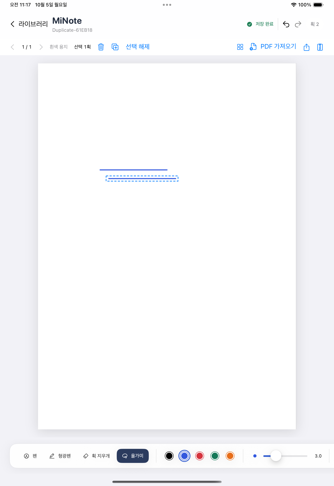

# M2-B — 선택 획 삭제·같은 페이지 복제

현재 상태: **2026-10-05 M2-B 완료**. 구현·양 OS 검증·한 번의 별도 리뷰 보완·Notion 기록을 완료했다. iPad 제품 전체 완료를 뜻하지 않으며, 실기기와 후속 기능은 아래에 구분한다.

## 현재 작동하는 기능

올가미 선택 뒤 휴지통 아이콘의 **선택 삭제**는 선택 획만 제거한다. **복제**는 원본을 유지하고 (20,20)pt에 새 UUID의 복제본을 추가한다. 새 복제본들만 선택하며 반복 복제가 가능하다. 펜/지우개/명령은 실제 production canvas의 같은 UndoManager 이력을 사용한다. Undo/Redo는 선택을 비우고 저장하며, 명령 직전 마지막 live canvas 입력도 캡처한다.

빈 선택/잘못된 좌표/저장 실패/busy/이전 page·generation 요청은 문서와 이력을 덮어쓰지 않는다. 겹친 동일 획의 native 삭제에서 ID가 모호하면 추측하지 않고 현재 화면과 정상 primary/backup을 유지하며 Undo로 복구할 수 있다.

## 기술 결정과 이유

- 기존 schema3/catalog1/backup1 유지. Foundation 명령과 UIKit/PencilKit adapter를 분리한다. 다른 페이지·PDF bytes·용지·책갈피·삭제 metadata는 변경하지 않는다.
- 복제는 원본 문서 순서로 append한다. 새 UUID와 tx/ty만 바뀌고 제어점·선형 affine·도구·색상·압력·시간·seed는 동일하다. 페이지 밖 유한 좌표를 자르지 않는다.
- 명시적 snapshot 후 canonical history는 현재 획이며 historical aliases는 현재 UUID의 변형을 보존한다. 제거된 UUID가 새 동일 모양 펜 입력에 경쟁하지 않으며 Undo snapshot은 제거된 ID를 정확히 복구한다.
- command capture만 살아 있는 선택 UUID를 유지한다. 일반 native 입력은 선택을 초기화한다. final B→명령→queued delegate가 native와 명령 각각 한 Undo로 이어지는 회귀를 통과했다.
- 새 버튼은 한국어 접근성 이름을 가진 작은 아이콘이다. 실제 iPad portrait screenshot에서 기존 page/PDF/backup controls와 함께 표시되는 것을 확인했다.
- 백업 새 노트는 기존 라이브러리에 충돌이 없으면 문서 ID를 유지하고 충돌 시 새 ID를 만든다. 이번 새 테스트의 초기 잘못된 기대를 기존 계약에 맞춰 바로잡았다. 저장 제품 로직을 바꾸지 않았다.

## 검증 증거

- Core91/0, Node36/0, v2/v3/lasso/selection fixture check exit0.
- 실제 선택 UI2/0 + read-only JSON22경계: pen→clone→pen→Undo3/Redo3와 delete→Undo/Redo→pen/eraser/Undo, 저장·relaunch. 파일/값/ID/순서·복제20pt·다른 metadata 전체 비교. `minote-m2b-ui-green1` 로그/result/observer를 `/private/tmp`에 보존한다.
- App94/0: autosave/reopen, `.minote` 새 library 복원/metadata/PDF bytes, ENOSPC raw system Undo/Redo 양 stack, 실제 backup chunkWriter gate/늦은 입력/이전 generation, 네 회전 crop PDF 출력 pixel, owned native reverse edit/save/reopen. `minote-m2b-task3-allapp-green`.
- 독립 왕복: actual app `selection-source`40→`selection-duplicated`41→`selection-deleted`42. UUID-only manifest를 읽은 JS가 자체 복사/변환/삭제로 전체 값 일치를 검사하고 세 추가 편집 `selection-edited`45를 만든다. iPad가 이것을 production owned native Undo로 다시 편집·저장·재열기한다. 기대 JSON 복사가 아니다.
- 초기 실패들은 보존했다. Core/App API missing 및 UI missing-button/fixture missing RED와, 빈 library restore ID의 잘못된 테스트 기대 실패를 구분한다. 캐시 권한 실패/오래된 app container 경로 부재를 제품 RED/성공으로 바꾸지 않았다.
- 18.6 전체: app94/0+일반UI11통과/fixture-only2skip/0fail,43 live JSON/PDF SHA observer exit0 (`minote-m2b18-final`). 화면 test 보완 후 별도 전체 app94/0 exit0 (`minote-m2b18-review-app-green`). 제품/UI 변경 없이 test-only 보완이어서 이미 성공한 UI를 중복 실행하지 않았다. 결과를 두 경로로 구분해 기록한다.
- 26.4 전체: 새 DerivedData `/private/tmp/minote-m2b-dd26-final`, cacheOFF. app94통과/0실패 + 일반UI11통과/fixture-only2skip/0실패, 43 live JSON/PDF SHA observer exit0 (`minote-m2b26-final`). 화면 검사 보완을 포함한 전체 명령이다.

실제 명령과 보존 위치:

```sh
swift test --package-path Packages/MiNoteCore
node --test Tools/PortableInk/*.test.mjs
node Tools/PortableInk/roundtrip.mjs --check
node Tools/PortableInk/roundtrip.mjs --v3 --check
node Tools/PortableInk/roundtrip.mjs --lasso --check
node Tools/PortableInk/roundtrip.mjs --selection --check
python3 Tools/LibraryTests/lasso_evidence.py 7964CDF4-782A-44C2-BC51-1176AF6C67AB /private/tmp/minote-m2b-dd18 /private/tmp/minote-m2b18-final.xcresult --all-tests
python3 Tools/LibraryTests/lasso_evidence.py 423D4FF6-C678-45F9-9D3E-CB886EE82462 /private/tmp/minote-m2b-dd26-final /private/tmp/minote-m2b26-final.xcresult --all-tests
```

helper는 MiNote scheme의 `xcodebuild test`를 직렬로 실행하고 `CODE_SIGNING_ALLOWED=NO COMPILATION_CACHE_ENABLE_CACHING=NO`를 설정한다. 각 result의 `.log`, `.ink-evidence`, `-observer.log`는 `/private/tmp`에 보존한다. Core 로그는 `minote-m2b-core-exchange.log`, Node는 `minote-m2b-node-exchange-green2.log`이다. 18.6 보완 후 앱 전체 명령의 로그/result는 `minote-m2b18-review-app-green.log/.xcresult`이며, 이는 앞선 UI 전체 결과와 구분한다. 두 fixture-only skip은 이전 설치 이주·빈 설치 파일 이동의 전용 환경이 없어 이번에 재실행하지 않은 것이며, 기존 M1-C 기록을 보존한다.

## 한 번의 최종 리뷰

fresh `/root/m2b_code_review`, `gpt-6-astra/high`, 읽기 전용, 범위 ea605bc..93de1ba. Critical0/Important1/Minor0. 제품 코드 결함은 보고되지 않았다. Important는 회전 PDF 화면 test host에 drawing이 없어 상수 좌표 왕복만 통과했던 검증 공백이다. 실제 UIKit 화면 pixel에서 원본/복제/삭제를 확인하는 검사로 빈 화면 white255 RED(exit65)→production coordinator.apply→GREEN18 app94/0를 확인했다.4회전·zoom1/2/5와 삭제 후 화면16장, 각 PDF output pixel을 검사한다. 프로그램 화면 rendering 회귀이며 물리 Pencil 입력 증거는 아니다. PDF 출력 pixel 근거는 기존에도 유효했다. 재리뷰하지 않고 회귀/전체 gate로 수정 결과를 확인한다.

## 한계와 다음 작업

실기기 Pencil 지연/손바닥/발열·장시간/큰 실제 문서·전체 접근성·외부 provider/공유 앱 호환은 미검증이다. Clipboard/다른 page paste는 M2-B2 다음 단위이며, 텍스트·이미지·검색·혼합 객체·부분 선택·크기/회전·다른 플랫폼·sync/협업은 후속이다. Undo/selection/aliases는 page 전환·복원·relaunch에서 초기화한다.

다음은 [M2-B2 clipboard 계획](../superpowers/plans/2026-10-05-m2-b2-clipboard.md)이며 계획만 작성했다. 실제 clipboard 코드/접근은 이번 실행에 없다.

리뷰의 판단 보류 항목도 분류했다. 물리 Pencil·큰 실제 문서와 장시간 사용, 전체 접근성·외부 공유/provider 호환은 M3 검증 대기다. 다른 플랫폼 제품 UI/rendering은 후속이며 JS는 계약 시험 도구다. Clipboard·다른 페이지 붙여넣기는 M2-B2, 텍스트·이미지·검색·혼합 객체·부분 선택·크기/회전은 후속 M2/M3다. 페이지 간 또는 영속 Undo는 현재 페이지/generation 수명으로 제한한 기존 계약에 따른다. 범위에서 빠진 기능을 완료로 주장하지 않는다.

재개 첫 작업은 AGENTS→PROGRESS→Git 상태→M2-B2 계획→기존 native history/identity/final capture 회귀 순으로 확인하고 Core payload/paste의 RED를 작성하는 것이다. 초기 8MiB/2,000획/100,000점은 다음 계획의 보수적인 한도이며 현재 구현이나 측정 성능이 아니다.

## Notion 포트폴리오 기록

[MiNote Notion](https://app.notion.com/p/3e76538f55f68051a2fad6f22562bd3d)에 M2-B 결과·설계 판단·검증표·리뷰 수정·미검증·다음 계획을 추가했다. async `task_9b1b2ebf939042f5b141f426ba351ef4` succeeded, 반영 시점은 **2026-10-05T03:01:05.588Z (12:01:05 KST)**이다. 재조회에서 기존 본문 48,143자가 정확한 prefix로 유지되고 새 M2-B 제목이 한 번만 나타나며 양 OS 검증표가 있는 것을 확인했다. 기존 첨부도 본문과 함께 유지한다. 새 화면 이미지는 업로드하지 않았다.

## 저장소와 실제 화면

main 직접 작업, 기준 ea605bc83d3b264fe262ce1f784031f96e3dda00, core9ce253c/app0a05bbd/영속·왕복93de1ba/리뷰 test 보완3cd7d6f. branch/worktree/PR/push 없음, 원격 새 조회 없음. 최종 문서 commit은 Git HEAD/[PROGRESS](../PROGRESS.md)로 확인한다. 모든 이전 기록/시뮬레이터 데이터/로그는 보존했다.



원본 XCTest PNG(`minote-m2b-ui-green1`, dupClone attachment)의 로컬 사본이다. 이 새 이미지는 외부로 전송하지 않았다. 실제 입력 화면 증거와 프로그램 callback 테스트·실기기 검증을 구분한다.
